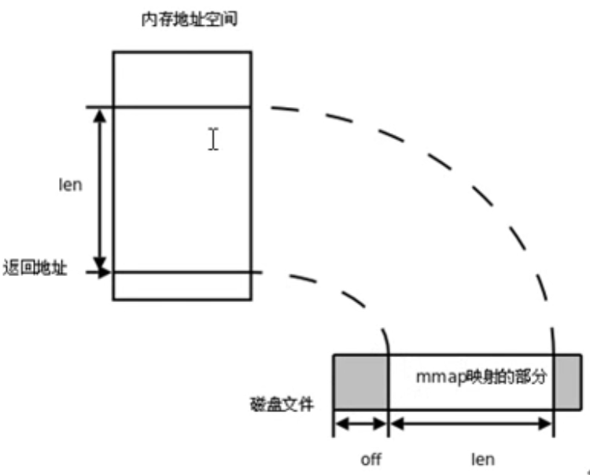

# **MMAP**

注：Memory-mapped I/O，存储映射

[TOC]

## **共享内存映射简述**

- 将磁盘空间文件映射到内存，原先磁盘空间的文件只能用read、write去进行操作，映射到内存后可以用指针相关的去操作数据。

- 首先需要在内存区申请一块共享内存，用于完成后续映射。

  映射关系如下图所示：

## **C-相关函数使用**

**创建共享内存映射**

void *mmap(void *addr, size_t length, int prot, int flags, int fd, off_t offset)

	参数：
		addr：	指定映射区的首地址。通常传NULL，表示让系统自动分配
		length：	共享内存映射区的大小。（<= 文件的实际大小）
		prot：	共享内存映射区的读写属性。PROT_READ、PROT_WRITE、PROT_READ|PROT_WRITE
		flags：	标注共享内存的共享属性。
				MAP_SHARED：表示对内存做的修改会同步到磁盘上，
				MAP_PRIVATE：表示对内存的修改不会同步到磁盘上。
		fd：		用于创建共享内存映射区的那个文件的 文件描述符。
		offset：	默认0，表示映射文件全部。偏移位置。需是 4k 的整数倍。
	
	返回值：
		成功：映射区的首地址。
		失败：MAP_FAILED (void*(-1))， errno

**释放映射区，释放共享内存**

int munmap(void *addr, size_t length)

	addr：	mmap 的返回值
	length：	大小

## **使用注意事项**

**注意事项**

	1、用于创建映射区的文件大小为 0，实际指定非0大小创建映射区，出 “总线错误，SIGBUS”。
	
	2、用于创建映射区的文件大小为 0，实际指定0大小创建映射区， 出 “无效参数，Invalid argument”。
	
	3、用于创建映射区的文件读写属性为只读。映射区属性为读、写。 出 “无效参数，Invalid argument”。
	
	4、创建映射区，磁盘文件必须需要read权限，这样映射区才可以读文件内的数据。
	   当访问权限指定为 “共享”MAP_SHARED时，mmap的读写权限，应该 <=文件的open权限。
	
	5、文件描述符fd，在mmap创建映射区完成即可关闭。后续访问文件，用 地址访问。
	
	6、offset 必须是 4096的整数倍。（MMU 映射的最小单位 4k ）
	
	7、对申请的映射区内存，不能越界访问。 
	
	8、munmap用于释放的 地址，必须是mmap申请返回的地址。
	
	9、映射区访问权限为 “私有”MAP_PRIVATE时, 对内存所做的所有修改，只在内存有效，不会反应到物理磁盘上。
	
	10、映射区访问权限为 “私有”MAP_PRIVATE时, 只需要open磁盘文件时，有读权限，用于创建映射区即可。

**mmap函数的保险调用方式**

	1. fd = open（"文件名"， O_RDWR）;
	
	2. mmap(NULL, 有效文件大小， PROT_READ|PROT_WRITE, MAP_SHARED, fd, 0);

## **进程间通信**

**父子进程使用 mmap 进程间通信**

	- 父进程 先 创建映射区。 open(O_RDWR) mmap(MAP_SHARED )，指定 MAP_SHARED 权限
	
	- fork() 创建子进程
	
	- 一个进程读， 另外一个进程写

**无血缘关系进程间 mmap 通信**

	- 两个进程 打开同一个文件 open
	
	- 创建映射区，mmap，指定flags 为 MAP_SHARED
	
	- 一个进程写入，另外一个进程读出
	
	【注意】无血缘关系进程间通信，mmap：数据可以重复读取，fifo：数据只能一次读取

**匿名映射：只能用于 血缘关系进程间通信**

	p = (int *)mmap(NULL, 40, PROT_READ|PROT_WRITE, MAP_SHARED|MAP_ANONYMOUS, -1, 0);
	
	对于部分不支持MAP_ANONYMOUS字段的系统：
	可以通过读/dev/zero获取fd，然后传递给mmap
	
	/dev/zero：摇钱树，数据想要多少有多少，都是空洞
	/dev/null：黑洞，数据想往里面写多少就写多少

## **相关代码实践**

- **创建共享内存以及释放**
  - /code/mmap/mmap_create_mmap_munmap.c
- **父子进程间通信**
  - /code/mmap/mmap_father_and_child_chat.c
- **无血缘关系进程间通信**
  - /code/mmap/mmap_two_proc_chat_read.c
  - /code/mmap/mmap_two_proc_chat_write.c
- **匿名映射，用于有血缘关系的进程间通信**
  - /code/mmap/mmap_noname_father_and_child.c