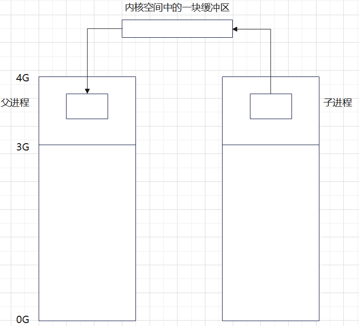

# **管道-pipe**

**实现原理**

- 有血缘关系的进程之间共享同一块内核区域

- 内核借助环形队列机制，使用内核缓冲区实现

  注：0-4G的虚拟内存，其中0-3G的用户区进程独享，3-4G内核区是共享的，因此在内核中利用内核缓冲区实现了管道通信

  

**特质**

- 管道为伪文件，不会占用磁盘空间，使用时占用内存，实际为内核的一块缓冲区域

  注：如管道、套接字、块设备、字符设备不会占用磁盘空间的我们称为伪文件

- 管道中的数据只能一次读取

  注：写入后其中一个进程读了，数据就没有了

- 数据在管道中，只能单向流动

**局限性**

- 只能用在血缘关系的进程间

- 自己写，不能自己读

- 数据不可以反复读

- 双向半双工方式通信，数据只能单方向流动

  注：双向半双工指两端只能一端读一端写，不能一端既读又写，如：对讲机；

  ​		双向全双工指两端可以同时读写，如：电话，socket通信。

  

**C - pipe函数：创建管道并打开**

	int pipe(int fd[2])
	参数
		fd[0]: 读端
		fd[1]: 写端
	返回值
		成功:0;失败： -1 errno

**管道的读写行为**

- 读管道

	- 管道有数据，read返回实际读到的字节数
	- 管道无数据
		1）无写端，read返回0 （类似读到文件尾）
		2）有写端，read阻塞等待

- 写管道

	- 管道无读端，异常终止（会有SIGPIPE信号导致）
	- 管道有读端
		1）管道已满，阻塞等待
		2）管道未满，返回写出的字节个数

