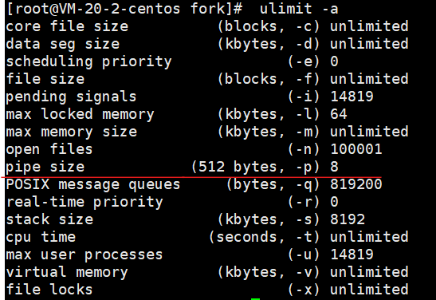

# **管道**

[TOC]

## **分类**

```
- pipe 管道、匿名管道 
- fifo 有名管道
```

## **pipe实现原理**

- 有血缘关系的进程之间共享同一块内核区域

- 内核借助环形队列机制，使用内核缓冲区实现

  注：0-4G的虚拟内存，其中0-3G的用户区进程独享，3-4G内核区是共享的，因此在内核中利用内核缓冲区实现了管道通信

  

## **pipe特质**

- 管道为伪文件，不会占用磁盘空间，使用时占用内存，实际为内核的一块缓冲区域

  注：如管道、套接字、块设备、字符设备不会占用磁盘空间的我们称为伪文件

- 管道中的数据只能一次读取

  注：写入后其中一个进程读了，数据就没有了

- 数据在管道中，只能单向流动


## **pipe局限性**

- 只能用在血缘关系的进程间

- 自己写，不能自己读

- 数据不可以反复读

- 双向半双工方式通信，数据只能单方向流动

  注：双向半双工指两端只能一端读一端写，不能一端既读又写，如：对讲机；

  ​		双向全双工指两端可以同时读写，如：电话，socket通信。

  

## **C - pipe函数：创建管道并打开**

	int pipe(int fd[2])
	参数
		fd[0]: 读端
		fd[1]: 写端
	返回值
		成功:0;失败： -1 errno

## **pipe的读写行为**

- 读管道

	- 管道有数据，read返回实际读到的字节数
	- 管道无数据
		1）无写端，read返回0 （类似读到文件尾）
		2）有写端，read阻塞等待

- 写管道

	- 管道无读端，异常终止（会有SIGPIPE信号导致）
	- 管道有读端
		1）管道已满，阻塞等待
		2）管道未满，返回写出的字节个数


## **pipe特殊情况**

- 管道可以一个读端多个写端存在
- 管道可以一个写端多个读端存在


## **pipe代码实现**

- 管道实现父子进程间普通读写
  - code/pipe_father_and_child_chat.c
- 管道实现父子进程之间 exec函数，实现 ls | wc -l 操作
  - code/pipe_father_and_child_ls_wc_l.c
- 管道实现兄弟进程之间 exec函数，实现 ls | wc -l 操作
  - code/pipe_brother_ls_wc_l.c
- 管道一个读端多个写端
  - code/pipe_two_write_one_read.c

## **系统相关pipe参数**

- 可通过 ulimit -a 查看默认的管道大小，如下图所示，如果没有设置默认为4K。




## **fifo简述**

- **原理**

  pipe实际是创建了一个匿名的管道用于由血缘关系的进程之间通信，而fifo实际是创建了真实的有名字的管道文件用于没有血缘关系的进程之间通信。

  

- **无血缘关系进程间通信**

  ```
  - 命名管道创建命令：mkfifo
  - 读端：open(name，O_RDONLY) => read
  - 写端：open(name, O_WRONLY) => write
  ```

## **fifo代码实现**

- fifo实现非血缘关系的进程间通信
  - code/fifo_read.c：读端进程
  - code/fifo_write.c：写端进程

